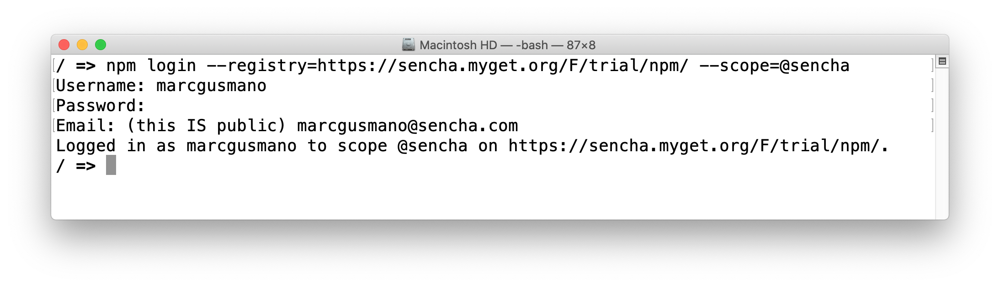

# ExtReactModern Quick Start

### Step 1: Retrieve npm repo access credentials

- Your npm repo access credentials are in the window to the left...

### Step 2: Start a terminal/command window and 'cd' to folder

- Start a terminal or command window
- 'cd' (change directory) to a location where you want to create the initial project folder

### Step 3: Login to the npm repository
- In the terminal/command window, login to the npm repo using your credentials
- Enter Username, Password and Email

<button onclick="copyToClipboard('npm login --registry=https://sencha.myget.org/F/trial/npm/ --scope=@sencha')">Copy to Clipboard</button>
```
npm login --registry=https://sencha.myget.org/F/trial/npm/ --scope=@sencha
```

- the image below shows the termanal/command window after suscessful login



### Step 4: Create a React application with create-react-app and ExtReact template

- In the terminal/command window, run the following:

<button onclick="copyToClipboard('npx create-react-app --template @sencha/ext-react-modern ext-react-modern-demo')">Copy to Clipboard</button>
```sh
npx create-react-app --template @sencha/ext-react-modern ext-react-modern-demo
```

- create-react-app will create a new application using the ext-react-modern template

- When create-react-app is completed, In the terminal/command window, run the following:

<button onclick="copyToClipboard('cd ext-react-modern-demo')">Copy to Clipboard</button>
```sh
cd ext-react-modern-demo
```

- To start the ExtReact application, run the following in the terminal/command window:

<button onclick="copyToClipboard('npm start')">Copy to Clipboard</button>
```sh
npm start
```

- The ExtReact application will load in a browser window!
